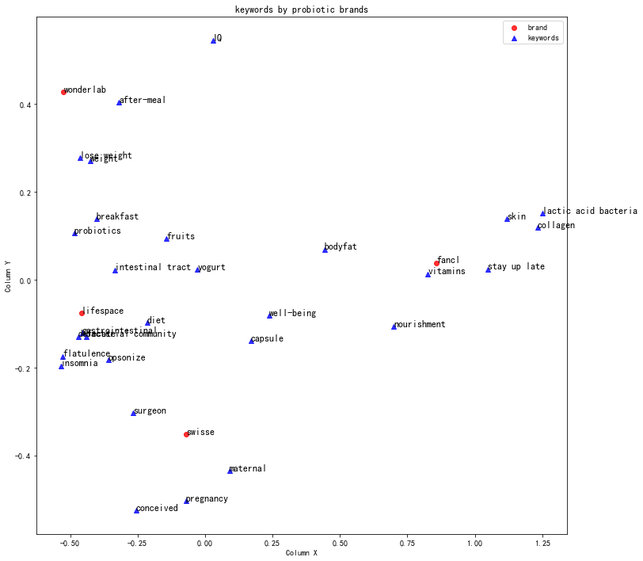

## Visualizing social media content by brand using Correspondence Analysis

### Background
When we have thousands of posts full of text and symbols from social media, it is difficult to tell what they are talking about at a glance, not to say detailing them with a further dimension, such as by brands mentioned, or quarters of the posts. 

In this analysis, I attempted to clean up about 2800 Chinese social media posts from RED (Little Red Book), cut text into words, generate cross tables of word frequency with brand, fit Correspondence Analysis and visualize the results. 

### Original Data
Original data is located at sample\sample_input.

There are two columns. "brand" contains the brand that the post is about, "content" contains the detailed content of the post.

### Files
- **sample_ca.py**: the python script that gets you the final output
- **sample_count.py**: the python script that cut words and calculates word frequency and document frequency. Word selection for CA visualization will start from output of this script.

Python scripts inside "topic_visualization" folder define functions to be used by outside scripts:
- **preprocess.py**: the functions that clean up text before word cut.
- **count_word.py**: the functions that cut words and calculate word freq and doc freq, also returns word property.
- **correspondenc_method.py**: the class contains functions to process tables into format that is ready for Correspondence Analysis, fit CA, draw scatter plot with coordinates and output image and coordinate results.
- **keywords_translation.py**: for better illustration, I personally added translation for selected keywords which were originally Chinese.

### Final output interpretation
In the scatter plot, each brand (shown in red dots) are surrounded by different key words (shown in blue triangle) respectively. The closer a word is near the brand, the more key word mentions can be found with this brand, therefore more associated with.

Words in the middle of the chart are commonly mentioned and shared among all brands, while words on the edge are unique to the brand at its closest.

From this chart, we can conclude that each probiotic brands stand out with distinct images and user perceptions:
- Wonderlab: a Chinese indigenous brand that resonates strongly among young people, mostly perceived as being good for weight loss.
- Lifespace: an Australian brand asserted to be probiotic expert, with an image of professional drug effect mentions.
- Swisse: also an Australian brand, but slightly more well-known among Chinese market, is perceived to be safe and quality products even for pregnant women.
- Fancl: a Japanese skincare and healthcare brand, hence its probiotics products are associated with its images of good skincare.

