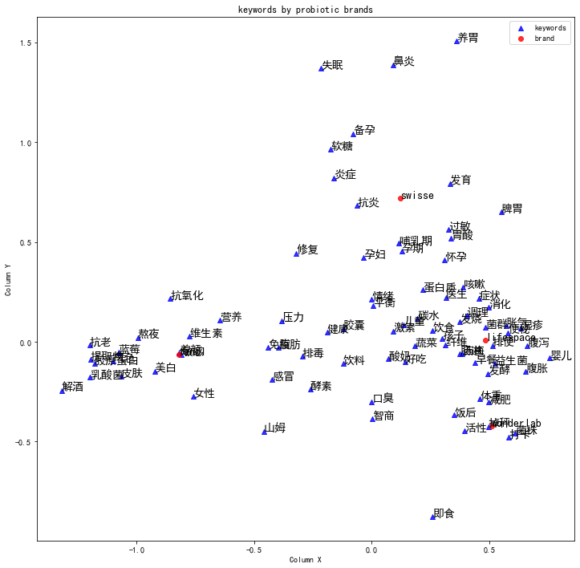

## Visualizing posts content by brand using Correspondence Analysis

### Background
When we have thousands of posts full of text and symbols from social media, it is difficult to tell what they are talking about at a glance, not to say detailing them with a further dimension, such as by brands mentioned, or quarters of the posts. 

In this analysis, I attempted to clean up about 2800 Chinese social media posts from RED (Little Red Book), cut text into words, generate cross tables of word frequency with brand, fit Correspondence Analysis and visualize the results. 

### Original Data
Original data is located at sample\sample_input.

There are two columns. "brand" contains the brand that the post is about, "content" contains the detailed content of the post.

### Final output interpretation
In the scatter plot, each brand (shown in red dots) are surrounded by different key words (shown in blue triangle) respectively. The closer a word is near the brand, the more key word mentions can be found with this brand, therefore more associated with.

Words in the middle of the chart are commonly mentioned and shared among all brands, while words on the edge are unique to the brand at its closest.

